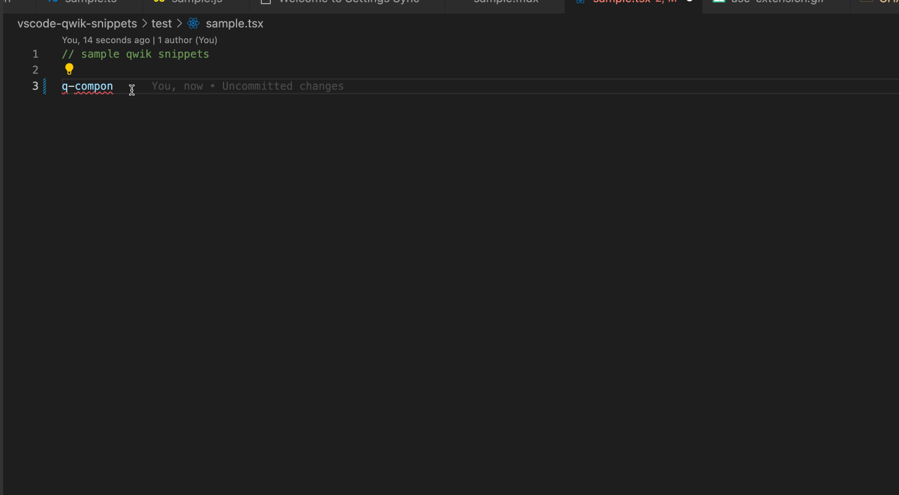

   
  
   

<h1 align='center'>Qwik Snippets</h1>

Language and Ecosystem Support for <a href='https://github.com/BuilderIO/qwik'>Qwik</a>.
  

Table of Contents

<!-- - [Qwik Essentials](#qwik-essentials) -->
- [What's new?](#whats-new)
  - [Qwik City Authoring Content](#qwik-city-authoring-content)
- [Usage](#usage)
- [Qwik Snippets](#qwik-snippets)
  - [Components](#components)
  - [Events](#events)
  - [Stores](#stores)
  - [Props](#props)
  - [Reactivity](#reactivity)
  - [Context](#context)
  - [Lifecycle Hooks](#lifecycle-hooks)
  - [Projection](#projection)
  - [Styling](#styling)
  - [$ Optimizer](#-optimizer)
  - [Composing New APIs](#composing-new-apis)
- [Qwik City Snippets](#qwik-city-snippets)
  - [Routing](#routing)
  - [Layout](#layout)
  - [Data](#data)
  - [Authoring Content](#authoring-content)
  - [Integrations](#integrations)
  - [Prefetching](#prefetching)
  - [Server Adaptors and Middleware](#server-adaptors-and-middleware)
  - [Static Site Generation](#static-site-generation)
  - [Head](#head)
- [Mitosis Snippets](#mitosis-snippets)
- [Partytown Snippets](#partytown-snippets)
- [Installation](#installation)
- [Contributing](#contributing)
- [Related Links](#related-links)
- [Issues](#issues)

 

**Updated for Qwik 0.11.1 release**

This extension for Visual Studio Code adds snippets for Qwik for TypeScript and MDX.

See the [CHANGELOG](CHANGELOG.md) for the latest changes

<!-- # Qwik Essentials

Check out the [Qwik Essentials extension](https://marketplace.visualstudio.com/items?itemName=johnreemar.qwik-essentials) for more great extensions for developing with Typescript and Qwik. -->

 

## What's new?

### [Qwik City Authoring Content](#authoring-content)

| Snippet                      | Purpose                                                              |
| ---------------------------- | -------------------------------------------------------------------- |
| `qc-mdx`                | Add mdx content                               |
| `qc-mdx-with-component` | Add mdx with qwik component                               |
| `qc-mdx-disable-default-plugins` | Disabling default MDX plugins included    |
| `qc-menu-structure` | Adding menu structure|
| `qc-useContent` | Retrieve menu structure|

<a href="#toc"><small>Back to Top</small>ꜛ</a>
## Usage

Type part of a snippet (e.g.: `q-component`), press `enter`, and the snippet unfolds.

`q-`  qwik
`qc-` qwik city
`m-`  mitosis
`p-`  partytown

Alternatively, press `Ctrl`+`Space` (Windows, Linux) or `Cmd`+`Space` (macOS) to activate snippets from within the editor.

<a href="#toc"><small>Back to Top</small>ꜛ</a>
##  Qwik Snippets

### Components
> Components are the building blocks of a Qwik application. Components are declared using component$() and at a minimum need to return a JSX Element.

| Snippet                      | Purpose                                                              |
| ---------------------------- | -------------------------------------------------------------------- |
| `q-component`                | Basic Qwik Component                                                 |
| `q-bind`                     | Add binding expression                                               |
| `q-inline-lite-component`         | Qwik  inline component                                               |
| `q-component-compose`        | Qwik Composing Components with child component                       |
| `q-component-with-binding`   | Qwik Component with binding                                          |
| `q-component-with-inline-component` | Qwik Component with inline component                          |
 
<a href="#toc"><small>Back to Top</small>ꜛ</a>
### Events
  
> A key feature of any framework is making it easy to listen to user events.
> >
> Qwik can listen on a variety of events by placing an on<Eventname>$ attribute on an element that subscribes to the corresponding browser event.

| Snippet                      | Purpose                                                              |
| ---------------------------- | -------------------------------------------------------------------- |
| `q-onClick`                  | Add an onClick event                                                 |
| `q-onBlur`                   | Add an onBlur event                                                  |
| `q-preventdefault`           | Add prevent default for click event                                  |
| `q-useOn`                    | Add an event on specific event on current host element               |
| `q-useOnDocument`            | Add an event on specific event on document.                          |
| `q-useOnWindow`              | Add an event on specific event on window.                            |

<a href="#toc"><small>Back to Top</small>ꜛ</a>
### Stores
>Qwik tracks application state for two reasons:
>
> 1. To serialize data when the application pauses on the server, and deserialize as the application resumes on the client.
> 
> 1. To create subscriptions on stores so that Qwik knows which components to re-render. If Qwik didn't track subscriptions, it would have to re-render the whole application - which would defeat the purpose of lazy-loading.

| Snippet                      | Purpose                                                              |
| ---------------------------- | -------------------------------------------------------------------- |
| `q-useStore`                | Add useStore()                       |
| `q-useStore-recursive`                | Add recursive useStore()                       |
| `q-component-with-store-and-props` | Qwik component with props and store   |
<a href="#toc"><small>Back to Top</small>ꜛ</a>
### Props
>Web applications are built up from components in the same way that general applications are built up from functions.
> 
> Composing functions would not be very useful if you couldn't pass in parameters. In the same way that functions have parameters, components have "props". A component uses props to pass data to its children components.

| Snippet                      | Purpose                                                              |
| ---------------------------- | -------------------------------------------------------------------- |
| `q-component-with-props`     | Qwik component with props           |
<a href="#toc"><small>Back to Top</small>ꜛ</a>
### Reactivity
> Reactivity is a key component of Qwik. Reactivity allows Qwik to track which components are subscribed to which state. This information enables Qwik to invalidate only the relevant component on state change, which minimizes the number of components that need to be re-rendered. Without reactivity, a state change would require re-rendering from the root component, which would force the whole component tree to be eagerly downloaded.

| Snippet                      | Purpose                                                              |
| ---------------------------- | -------------------------------------------------------------------- |
| `q-useSignal`                | useSignal() declaration             |
| `q-useWatch`                 | useWatch$() function hook          |
| `q-useResource`              | useResource$() declaration          |
<a href="#toc"><small>Back to Top</small>ꜛ</a>
### Context
> Use context to pass data to child components without explicitly passing it through components (known as prop drilling). Context is useful to share data that is needed throughout the application components. For example styling information, application state, or currently logged-in user.

| Snippet                      | Purpose                                                              |
| ---------------------------- | -------------------------------------------------------------------- |
| `q-createContext`   |     This creates a serializable ID for the context. Make sure that this id is unique within your application       |
| `q-useContextProvider`   |     At a parent component call this method to publish the context value. All children (and grandchildren) that are descendants of this component will be able to retrieve the context.       |
| `q-useContext`   |     To retrieve the context and use it in any component.       |
<a href="#toc"><small>Back to Top</small>ꜛ</a>

### Lifecycle Hooks
> Qwik is resumable. Resumability means that the application starts up on the server and then the application is transferred to the client. On the client, the application continues execution from where it left off. The implication of this is that a component may be created on the server and destroyed on the client. This means that the component's `useMount$()` method may execute on the server but its `useCleanup$()` method may execute on the client.
> 
> When using lifecycle hooks, you must adhere to the following rules:
> - They can only be called in `component$`
> - They can only be called at the root level of a function / arrow function context, not inside of branches or conditional blocks
> - They can only be called from another `use*$` method, allowing for composition

| Snippet                      | Purpose                                                              |
| ---------------------------- | -------------------------------------------------------------------- |
| `q-useMount`                 | `useMount$()` function hook. Hook that executes a callback when the component is mounted into the rendering tree.                           |
| `q-useServerMount`           | `useServerMount$()` function hook: Hook that executes on the component mount when in a server environment. This is useful because server often has different APIs for retrieving data.                           |
| `q-useClientEffect`          | Use `useClientEffect$()` to execute code after the component is resumed. This is useful for setting up timers or streams on the client when the application is resumed.       |
| `q-useWatch`                 | Use `useWatch$()` to execute a function before the initial render and whenever the tracking values change. The function executes before rendering, but it can't delay rendering, so if `useWatch$()` is asynchronous, the rendering will happen before the `useWatch$()` is fully executed.            |
| `q-useRef`                 | Use `useRef()` to get a hold of DOM elements created by the component.     |
| `q-useOn`                  | Add an event on specific event on current host element   |
| `q-useOnDocument`            | Add an event on specific event on document.          |
| `q-useOnWindow`              | Add an event on specific event on window.         |
<a href="#toc"><small>Back to Top</small>ꜛ</a>
### Projection
> Projection is a way of passing content to a child component that in turn controls where the content is rendered. Projection is a collaboration between the parent and child component. The parent component decides what is the content that needs to be rendered, child component decides where and if the content should be rendered.

| Snippet                      | Purpose                                                              |
| ---------------------------- | -------------------------------------------------------------------- |
| `q-projection`         | Projection is a way of passing content to a child component that in turn controls where the content is rendered. Projection is a collaboration between the parent and child component. The parent component decides what is the content that needs to be rendered, child component decides where and if the content should be rendered.                                      |
| `q-projection-named-slot`         | In simple cases, projection allows content from the parent component to be projected into the child component. In more complex cases there may be more than one content slot that needs to be projected. Having multiple content slots is achieved by naming them.                    |
<a href="#toc"><small>Back to Top</small>ꜛ</a>
### Styling
> Styling is an important part of the design of a web application. Qwik is responsible for loading the style information when a component is mounted. Use `useStyles$()` to tell Qwik which style should be loaded.
> 
| Snippet                      | Purpose                                                              |
| ---------------------------- | -------------------------------------------------------------------- |
| `q-useStyles$`         | Qwik is responsible for loading the style information when a component is mounted. Use useStyles$() to tell Qwik which style should be loaded.      |
| `q-useStylesScoped$`         | Use useStylesScoped$() to load and scope the style to a specific component only.      |
<a href="#toc"><small>Back to Top</small>ꜛ</a>

### $ Optimizer
> Qwik's philosophy is to delay loading code for as long as possible. To do that, Qwik relies on Optimizer to re-arrange the code for lazy loading. The Optimizer is code level transformation that runs as part of the rollup. (Optimizer is written in Rust (and available as WASM) for instant performance)
>
> The Optimizer looks for `$` and applies a transformation that extracts the expression following the `$` and turns it into a lazy-loadable and importable symbol.

| Snippet                      | Purpose                                                              |
| ---------------------------- | -------------------------------------------------------------------- |
| `q-$-hook`                | $() function hook                      |
| `q-lazy-loading-constants`                | For the application to be resumable it needs to have lots of entry points. For example, clicking on button A is a different entry point than clicking on button B. When we implement an application we don't usually think about entry points and so we typically end up with just one entry point or the main() function.  The Optimizer does its job by looking for functions that end in `$` character. For example, the Optimizer will transform a call to `component$()` into an entry point. Notice that the name of the function doesn't matter only that it ends with the `$`. Every time you see `$` you should think, there is a lazy-loaded boundary here. The implication is that the lazy-loaded content may require lazy-loading and hence can't be accessed synchronously.  While the Optimizer can serialize any data that Qwik can serialize, it has special handling for closures. Closures are functions that are created inside of other functions and that may capture variables in the lexical scope. The ability to serialize closures is a key property that makes Qwik resumable. Without closure serialization, it would be difficult to have resumable applications.                      |
| `q-lazy-loading-closures`                | A closure can be converted into a lazy-loaded reference using the `$()` function. This generates a `QRL<Function>` type. A QRL is a lazy-loadable reference of the closure. In our case, we have extracted the closure associated with the onInput event into the component body. Because it is no longer inlined we need to change how the JSX refers to it from onInput$ to `onInputQrl`. Notice that our closure closes over the store that is captured by the Optimizer and then restored as needed.|
<a href="#toc"><small>Back to Top</small>ꜛ</a>

### Composing New APIs
> The powerful, part of Optimizer is that you can create your own APIs with $ suffix.

| Snippet                      | Purpose                                                              |
| ---------------------------- | -------------------------------------------------------------------- |
| `q-create-api-$`             | This method knows how to take a QRL and execute it after a certain delay. The key part here is that the QRL.invoke() method is called when the delay is ready and is therefore lazy.                 |
| `q-composing-use-hook`       | Hooks are a way to abstract common logic away from the components that use it. They are a way to share logic between components. While Qwik provides many hooks, there will always be one that is not provided out of the box. This tutorial will show you how to create your own hook. n this example, the registering of mousemove events is something that could be shared between multiple components. Refactor the code by pulling out the code before JSX into its own useMousePosition() function.      |
<a href="#toc"><small>Back to Top</small>ꜛ</a>
 

## Qwik City Snippets

### Routing
> Routing is a way to map public URLs for a site to specific components declared in your application.
>
> Qwik City uses directory-based routing. This means that the structure of your routes directory drives the public-facing URLs that the user will see for your application. However, it differs slightly from traditional file-based routing, which we will discuss shortly.
> 
| Snippet                      | Purpose                                                              |
| ---------------------------- | -------------------------------------------------------------------- |
| `qc-useLocation`              | Retrieve the Route Parameter from the URL    |
| `qc-404-not-found`              | At times it is necessary to respond with HTTP status codes other than `200`. In such cases, response handler is the place to determine what status code should be returned.    |
<a href="#toc"><small>Back to Top</small>ꜛ</a>
### Layout
> When implementing routes, different routes usually share a common header, footer, and menu system. We call the common parts a layout.
>
> The developer could extract all of these into `<Header>`, `<Footer>`, and `<Menu>` components and manually add them to each page component, but that is repetitive and error-prone. Instead, we can use layouts to automatically reuse common parts.

| Snippet                      | Purpose                                                              |
| ---------------------------- | -------------------------------------------------------------------- |
| `qc-layout`                  | Add sample layout                   |
| `qc-layout-structure`        | Add sample layout structure                  |
| `qc-nested-layout`           | Add sample nested layout            |
| `qc-nested-layout-structure` | Add sample nested layout structure     |
| `qc-grouped-layout-structure`| Add sample group layout structure     |
| `qc-named-layout-structure`  | Add sample named layout structure           |
| `qc-top-layout-structure`    | Add sample top layout structure           |
| `qc-menu`                    | Add sample menu                     |
| `qc-header`                  | Add sample header                   |
| `qc-footer`                  | Add sample footer                   |
<a href="#toc"><small>Back to Top</small>ꜛ</a>

### Data
> Each route has the ability to add HTTP request and response handlers, allowing for developers to retrieve and modify data. The handlers can also be used by endpoints, which only respond with data rather than a page's HTML.
>
> This feature enables you to handle any request event, have side effects on the request pipeline, just before you render the component and respond with custom content. It is available to pages, layouts and endpoint routes, but not on regular components.
> 
| Snippet                      | Purpose                                                              |
| ---------------------------- | -------------------------------------------------------------------- |
| `qc-onGet`                | onGet API route                                                 |
| `qc-onGet-sample`                | onGet API route sample                                                |
| `qc-onGet-in-component`                | onGet API route in a component                                            |
| `qc-onPost`                | onPost API route                                                 |
| `qc-onPut`                | onPut API route                                                 |
| `qc-onPut-sample`                | onPut API route sample                                                |
| `qc-onPatch`                | onPatch API route                                                 |
| `qc-onDelete`                | onDelete API route                                                 |
| `qc-redirect`                | redirect route                                                 |
| `qc-redirect-sample`          | redirect route sample                                                 |
| `qc-useEndpoint`          | add useEndpoint declaration                                                 |
<a href="#toc"><small>Back to Top</small>ꜛ</a>
### Authoring Content
> Page content can be created using Qwik components. The component representing the content should be exported as a default export.
> 
| Snippet                      | Purpose                                                              |
| ---------------------------- | -------------------------------------------------------------------- |
| `q-component`                | Add mdx content                               |
| `qc-component-import`        | Importing other components. You can build complex views by composing multiple components within each other. To do that import other components into your index.tsx file.                             |
| `qc-mdx`                | Add mdx content                               |
| `qc-mdx-with-component` | Add mdx with qwik component                               |
| `qc-mdx-disable-default-plugins` | Disabling default MDX plugins included.     |
| `qc-menu-structure` | Adding menu structure|
| `qc-useContent` | Retrieve menu structure|
| `qc-use-content-menu-in-layout` | While useContent() can be invoked from any component that is part of the current route. It is typically used in a layout component (or a component used by layout) to render the menu.|
<a href="#toc"><small>Back to Top</small>ꜛ</a>

### Integrations
> React, Partytown, Tailwind
> 
| Snippet                      | Purpose                                                              |
| ---------------------------- | -------------------------------------------------------------------- |
| `qc-qwikify-react-component`                | Qwikify a react component    |
| `qc-qwikify-react-event`                | Qwikify React Event. Events in React are handled by passing a function as a property to the component.    |
| `qc-qwikify-eagerness`                | Qwikify a react component with eagerness |
| `qc-client-load`                | Add client load interactivity |
| `qc-client-idle`                | Add client idle interactivity |
| `qc-client-visible`                | Add client visible interactivity |
| `qc-client-hover`                | Add client hover interactivity |
| `qc-client-signal`                | Add client signal interactivity |
| `qc-client-click-event`                | Add client click event interactivity |
| `qc-client-only`                | Add client only interactivity |
| `qc-partytown`                | Add party town|
| `qc-partytown-sample`                | Add partytown sample code |
| `qc-tailwind`                | Add tailwind css |

<a href="#toc"><small>Back to Top</small>ꜛ</a>
### Prefetching
> The goal of Qwik's prefetching is not to prefetch the entire application, but to have already prefetched and cached what's possible at that time. When the Qwik optimizer breaks apart the application, it's able to understand possible user interactions. And from this, it's just as important that it's able to understand what's not possible from user interaction.

| Snippet                      | Purpose                                                              |
| ---------------------------- | -------------------------------------------------------------------- |
| `qc-prefetching`                | WIP                                                 |
<a href="#toc"><small>Back to Top</small>ꜛ</a>
### Server Adaptors and Middleware
> Qwik City middleware is a glue code that connects server rendering framework (such as Cloudflare, Netlify, Express etc.) with the Qwik City meta-framework.
> 
| Snippet                      | Purpose                                                              |
| ---------------------------- | -------------------------------------------------------------------- |
| `qc-adaptors`                | WIP                                                 |
<a href="#toc"><small>Back to Top</small>ꜛ</a>
### Static Site Generation
> Static Site Generation, or commonly referred to as "SSG", is the process of pre-rendering site webpages into static HTML files. The benefit is that when a visitor requests the webpage, the response is a pre-generated HTML file (a static file), and doesn't require the webpage's HTML to "rebuild" on the visitors browser, or dynamically created by your server.

| Snippet                      | Purpose                                                              |
| ---------------------------- | -------------------------------------------------------------------- |
| `qc-static`                | WIP                                                 |
<a href="#toc"><small>Back to Top</small>ꜛ</a>
### Head
> HTML places the <head> tag as the first element within <html> (at the very top of the HTML content). The <head> section is not something that your route component renders directly, yet you still need to control its content. This can be achieved by exporting a head property (or function) from your page component.
> 
| Snippet                      | Purpose                                                              |
| ---------------------------- | -------------------------------------------------------------------- |
| `qc-head`                | WIP                                                 |
<a href="#toc"><small>Back to Top</small>ꜛ</a>

 

## Mitosis Snippets

| Snippet                      | Purpose                                                              |
| ---------------------------- | -------------------------------------------------------------------- |
| `m-xxx`                | WIP                                                            |
<a href="#toc"><small>Back to Top</small>ꜛ</a>

 

## Partytown Snippets

| Snippet                      | Purpose                                                              |
| ---------------------------- | -------------------------------------------------------------------- |
| `p-xxx`                | WIP                                                            |
<a href="#toc"><small>Back to Top</small>ꜛ</a>

## Installation

1. Install Visual Studio Code 1.10.0 or higher
1. Launch Code
1. From the command palette `Ctrl`-`Shift`-`P` (Windows, Linux) or `Cmd`-`Shift`-`P` (OSX)
1. Select `Install Extension`
1. Choose the extension, Qwik Snippets
1. Reload Visual Studio Code

## Contributing

We love contributions! Check out our [contributing docs](./contributing/CONTRIBUTING.md) to get more details into how to run this project, the examples, and more all locally.

<a href="#toc"><small>Back to Top</small>ꜛ</a>
## Related Links

- [Qwik Docs](https://qwik.builder.io/)
- [Discord](https://qwik.builder.io/chat)
- [Qwik GitHub](https://github.com/BuilderIO/qwik)
- [@QwikDev](https://twitter.com/QwikDev)
- [Vite](https://vitejs.dev/)
- [Partytown](https://partytown.builder.io/)
- [Mitosis](https://github.com/BuilderIO/mitosis)
- [Builder.io](https://www.builder.io/)
- [Qwik Lottie](https://www.npmjs.com/package/qwik-lottie)
- [Qwik Rive](https://www.npmjs.com/package/qwik-rive)
- [Awesome Qwik](https://github.com/qwik-design/awesome-qwik)
  
<a href="#toc"><small>Back to Top</small>ꜛ</a>
## Issues

Have an issue with using the snippets, or want to suggest new snippets to help make your development life better? Log an issue in our [issues](https://github.com/qwik-design/vscode-qwik-snippets/issues) tab! You can also browse older issues and discussion threads there to see solutions that may have worked for common problems.
<a href="#toc"><small>Back to Top</small>ꜛ</a>